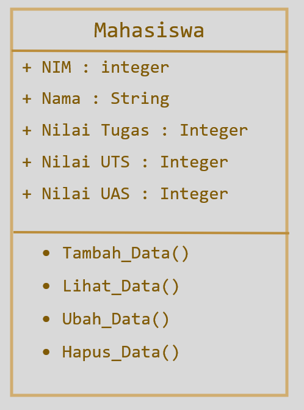
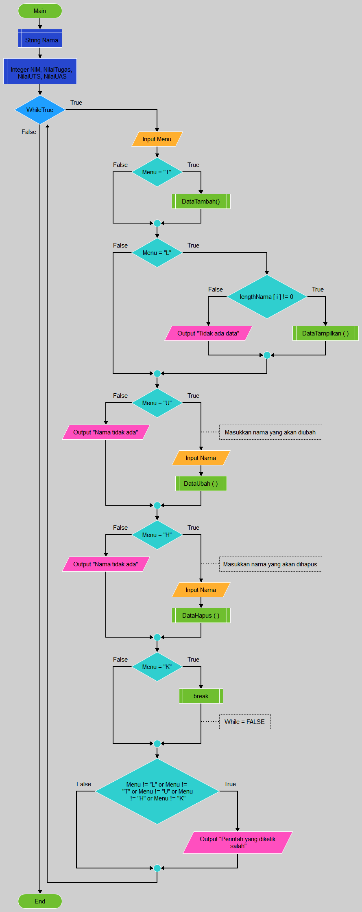
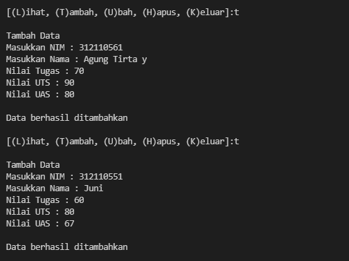
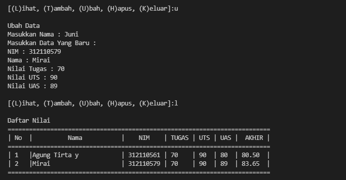
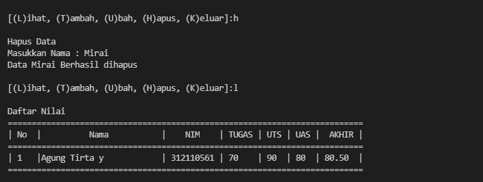

# # OOP di bahasa PYTHON 
##### Nama   : Agung Tirta Yasha 
##### Nim    : 312110561
##### kelas  : TI.21.C.5
##### Matkul : pemrograman 
##
Buat program sederhana dengan mengaplikasikan penggunaan class. Buatlah class untuk menampilkan daftar nilai mahasiswa, dengan ketentuan:

Method tambah() untuk menambah data
Method tampilkan() untuk menampilkan data
Method hapus() untuk menghapus data berdasarkan nama
Method ubah() untuk mengubah data berdasarkan nama

## Diagram class

## Flowchart

Pertama kita mendeklarasikan sebuah class Mahasiswa yang didalamnya terdapat atribut NIM, Nama, nilai tugas, nilai UTS dan nilai UAS.

selanjutnya membuat dictionary osong sebagai tempat menyimpan data-data yang sudah kita input. Ada 5 list kosong yang nanti isinya yaitu NIM, Nama, nilai tugas, nilai UTS dan nilai UAS.

Kita akan buat beberapa method untuk menambahkan, menampilkan, menghapus, mengubah data mahasiswa.
Pertama membuat method tambah(), method ini berfungsi untuk menambahkan data. Dalam method ini kita menggunakan append() supaya data yang terakhir ditambahkan, ada di urutan list paling akhir.

    def tambah(self,nim,nama,tugas,uts,uas):
        data.nim.append(nim)
        data.nama.append(nama)
        data.tugas.append(tugas)
        data.uts.append(uts)
        data.uas.append(uas)

tampilan method tambah() :

Membuat method lihat(), gunanya untuk menampilkan seluruh data yang sudah kita tambahkan tadi yang telah di input ke method tambah(). Kita menggunakan for loop untuk menampilkan banyaknya data. Nantinya data akan ditampilkan sebanyak n kali.

    def lihat(self):
        for i in range(len(data.nama)):
            print("|", i+1, "  |", end="")
            print('{0:<25}'.format(self.nama[i]), end="")
            print("|", self.nim[i], end="")
            print(" |", self.tugas[i], end="")
            print("    |", self.uts[i], end="")
            print("  |", self.uas[i], " | ", end="")
            print(f'{((self.tugas[i]*30/100) + (self.uts[i]*35/100) + (self.uas[i]*35/100)) :.2f}', " |")

tampilan lihat() dengan data yang sudah di input :

Membuat method ubah() yang fungsinya untuk mengubah data. jika method ini dipanggil, maka data Nama, NIM, nilai tugas, nilai UTS, nilai UAS index nomor - (no) akan diubah sesuai dengan inputan dari user.

    def ubah(self,nim,nama,tugas,uts,uas):
        self.nim[no] = nim
        self.nama[no] = nama
        self.tugas[no] = tugas
        self.uts[no] = uts
        self.uas[no] = uas

tampilan ubah() mengubah data yang sudah ada.

Terakhir kita buat method hapus(). Gunanya adalah menghapus data berdasarkan nama. Kita bisa menggunakan del untuk menghapus datanya. Seperti tadi, nomor index list yang akan dihapus disesuaikan dengan inputan dari user. Yaitu index nomor ke - (no).

    def hapus(self):
        del self.nim[no]
        del self.nama[no]
        del self.tugas[no]
        del self.uts[no]
        del self.uas[no]

tampilan hapus() data yang sudah ada.

### Program
penjalankan program dan bisa memanggil masing-masing methods, seperti biasa kita menggunakan while loop yang didalamnya ada conditional seperti ini.

    elif menu == "l" or menu == "L":
        print("\nDaftar Nilai")
        print("==========================================================================")
        print("| No  |          Nama           |    NIM    | TUGAS | UTS | UAS |  AKHIR |")
        print("==========================================================================")
        if len(data.nama) != 0:
            data.lihat()
        else:
            print("                         TIDAK ADA DATA                               ")
        print("==========================================================================")

    elif menu == "u" or menu == "U":
        print("\nUbah Data")
        ubah = input("Masukkan Nama : ")
        if ubah in data.nama:
           no = data.nama.index(ubah)
           print("Masukkan Data Yang Baru : ")
           data.ubah(
               input("NIM : "),
               input("Nama : "),
               int(input("Nilai Tugas : ")),
               int(input("Nilai UTS : ")),
               int(input("Nilai UAS : "))
               )
        else:
            print(ubah, "tidak ada di dalam data")

    elif menu == "h" or menu == "H":
        print("\nHapus Data")
        hapus = input("Masukkan Nama : ")
        if hapus in data.nama:
            no = data.nama.index(hapus)
            data.hapus()
            print("Data", hapus, "Berhasil dihapus")
        else:
            print(hapus, "tidak ada di dalam data")

    elif menu == "k" or menu == "K":
        print("\nTerimakasih\n")
        break

    else:
        print("\nPerintah yang dimasukkan salah!\n")

### Terima Kasih